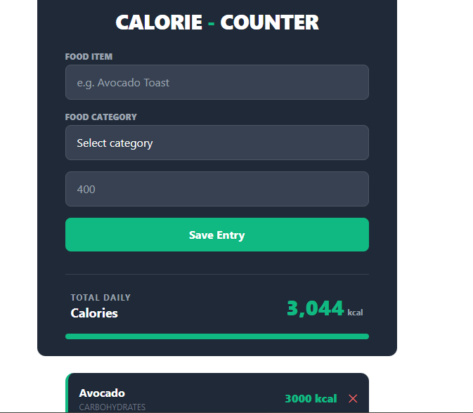

# Calorie-Counter
It is a persistent web application designed to track daily nutritional intake through a dynamic user interface and local data storage. It allows users to log food items, categorize them, and monitor their progress against a predefined goal in real-time.
## 🚀 Features
- Dynamic Data Management (CRUD): * Create: Users can add new food entries via a validated form.

- Read: The app automatically renders the list of entries from saved data.

- Delete: Users can remove individual items from the history using the "✕" button.

- Reset: A "Reset Data" function clears the entire session and storage.

- Persistent Storage: Uses the Web Storage API (localStorage) to save the calorieHistory array as a JSON string. This ensures data remains available even if the browser is refreshed or closed.

- Real-time UI Synchronization: The updateUI() . Every time data is added or deleted, the function clears the DOM and rebuilds the list, total count, and progress bar to ensure the display is always accurate.

### Progressive Goal Tracking:

- Mathematical Calculation: Calculates progress based on a DAILY_GOAL constant (e.g., 3,000 kcal).

- Dynamic Styling: Updates the CSS width property of the progress bar in real-time.

## 🛠️ Technologies Used
- HTML5: Semantic structure.

- TailWind CSS: Styling and layout.

- JavaScript (ES6+):  DOM manipulation, and Event Listeners.

- Local Storage


## Installation and Setup
### 1. Clone the Repository:

```bash
git clone git@github.com:winstone-1/Calorie-Counter.git
```
### 2. Navigate into Folder
```bash 
cd Calorie-Counter
```


## Screenshot


## Support and Contact Information
**email:** winstonemuna404@gmail.com
**Phone number:** 0795278996

## Live Link
[see my website]([text](https://winstone-1.github.io/Calorie-Counter/))
## Known Bugs
There are no bugs
## License
### MIT License